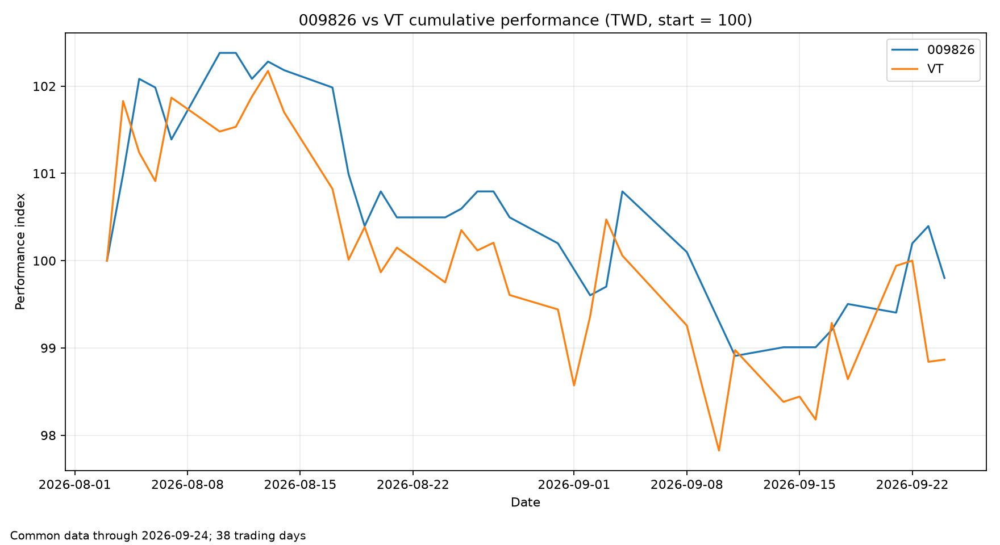

# 009826 vs VT

比較 009826 貝萊德世界股票與 Vanguard Total World Stock ETF（VT）的每日累積績效。



## 最新結果

- 共同完整資料：2026-08-03 至 2026-09-24，共 38 個交易日
- 009826：99.8016
- VT（美元市場價格換算新臺幣，未含配息再投入）：98.8666
- 差距：009826 領先 VT 0.9350 個百分點
- 基準：兩者於 2026-08-03 均標準化為 100

## 資料來源

- 009826：臺灣證券交易所（TWSE）個股日成交資訊
- VT：Vanguard 官方 Historical prices
- USD/TWD：中華民國中央銀行 NT$/US$ Closing Rate

資料採單一來源、單一月份分次擷取，來源成功後才合併既有 CSV；中斷時保留既有資料，不覆蓋已成功下載的歷史紀錄。

## 比較規格

- 起算日：009826 上市日 2026-08-03
- 顯示幣別：新臺幣
- 009826：市場收盤價
- VT：市場收盤價乘以當日 USD/TWD 收盤匯率
- 起始值：兩者均為 100

目前 VT 序列使用美元市場價格換算新臺幣，未納入配息再投入；跨越除息日後，必須加入配息再投入計算，才可稱為總報酬。

## 目錄

- `scripts/update_sources.py`：分次更新 TWSE、Vanguard、中央銀行來源資料
- `scripts/fetch_and_calculate.py`：合併資料、計算累積績效並產圖
- `data/source/`：三個來源的 raw data
- `data/processed/performance.csv`：共同交易日的整理資料
- `reports/performance.html`：互動式線圖
- `reports/performance.png`：靜態線圖
- `.github/workflows/daily-update.yml`：平日約台灣時間 17:30 自動更新

## 驗證

GitHub Actions 每次產生報告時，會核對 CSV 的日期範圍與筆數、HTML 註記、PNG 中繼資料及本 README 最新結果區塊。任何一項與本次共同資料不一致，工作流程就會失敗。

[查看首次成功執行紀錄](https://github.com/g2096204139-prog/009826_vs_VT/actions/runs/33538733948)

## 執行

```bash
python -m pip install -r requirements.txt
python -m playwright install chromium
python scripts/update_sources.py
python scripts/fetch_and_calculate.py
```

## 重要限制

009826 上市時間很短，不能由目前結果推論長期績效。未納入個人交易手續費、證券交易稅、匯款費、複委託費用或個人稅務結果；圖表不是投資建議。
