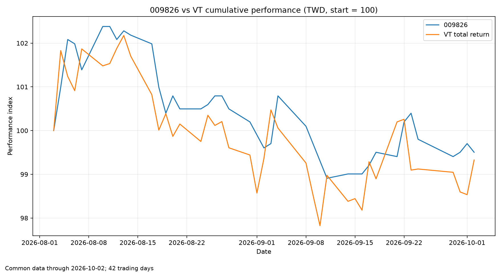

# 009826 vs VT

比較 009826 貝萊德世界股票與 Vanguard Total World Stock ETF（VT）的每日累積績效。



## 最新結果

- 共同完整資料：2026-08-03 至 2026-10-08，共 46 個交易日
- 009826：100.1984
- VT（含息總報酬；配息按除息日收盤再投入後換算新臺幣）：99.2176
- 差距：009826 領先 VT 0.9808 個百分點
- 基準：兩者於 2026-08-03 均標準化為 100

## 資料來源

- 009826：臺灣證券交易所（TWSE）個股日成交資訊
- VT 價格與配息：Vanguard 官方價格／配息頁
- USD/TWD：中華民國中央銀行 NT$/US$ Closing Rate

VT 原始配息資料獨立保存在 data/source/vt_distributions.csv，記錄除息日、每股美元配息、記錄日、發放日、配息類型、來源網址及擷取時間。來源更新成功後才合併既有 CSV；擷取失敗時保留快取並使工作流程失敗。

## 比較規格

- 起算日：009826 上市日 2026-08-03
- 顯示幣別：新臺幣
- 009826：市場收盤價
- VT：按完整美股交易日以 (當日收盤價 + 每股除息金額) / 前一美股交易日收盤價計算美元總報酬，再按同日央行 USD/TWD 收盤匯率換算
- 配息總報酬先使用完整 Vanguard 交易日計算，再對齊 TWSE、Vanguard 與央行均有資料的共同日期
- 起始值：兩者均為 100

此標準化再投入模型不扣美國預扣稅、交易成本或匯款費，也不模擬券商實際入帳時間及零股處理。

## 目錄

- `scripts/update_sources.py`：分次更新 TWSE、Vanguard、中央銀行來源資料
- `scripts/fetch_and_calculate.py`：合併資料、計算累積績效並產圖
- `data/source/`：三個來源的 raw data
- `data/processed/performance.csv`：共同交易日的整理資料
- `reports/performance.html`：互動式線圖
- `reports/performance.png`：靜態線圖
- `.github/workflows/daily-update.yml`：平日約台灣時間 17:30 自動更新

## 驗證

比較口徑與凍結方法見 [公平比較規格 v0.2](docs/comparison-spec-v0.2.md)。目前圖表為市場價格口徑、持有人稅費前的理論含息比較；009826 現行不配息，底層股息效果已反映於基金，不另外加一次。基金 NAV 對各自基準的比較與個人稅後報酬尚缺資料。

每次更新另產生 [資料品質摘要](data/processed/data_quality.json)，記錄四來源截止日、列數、重複鍵、缺值、相對缺日、擷取時間與原始位元組 SHA-256。行情以觀察日評估新鮮度，配息以擷取時間評估；7 個日曆日為作業攔截上限。未核對官方交易日曆的相對缺日仍列為未知，不能據此宣稱完整無漏日。

四來源先暫存並通過品質檢查才發布；抓取／檢查失敗保留全部舊來源，發布發生正常例外時還原舊檔。工作流程任何步驟失敗均不自動提交。

GitHub Actions 每次產生報告時，會核對 CSV 的日期範圍與筆數、HTML 註記、PNG 中繼資料及本 README 最新結果區塊。任何一項與本次共同資料不一致，工作流程就會失敗。

[查看首次成功執行紀錄](https://github.com/g2096204139-prog/009826_vs_VT/actions/runs/33538733948)

## 執行

```bash
python -m pip install -r requirements.txt
python -m playwright install chromium
python scripts/update_sources.py
python scripts/fetch_and_calculate.py
python scripts/data_quality.py
```

## 重要限制

009826 上市時間很短，不能由目前結果推論長期績效。未納入個人交易手續費、證券交易稅、匯款費、複委託費用或個人稅務結果；圖表不是投資建議。

